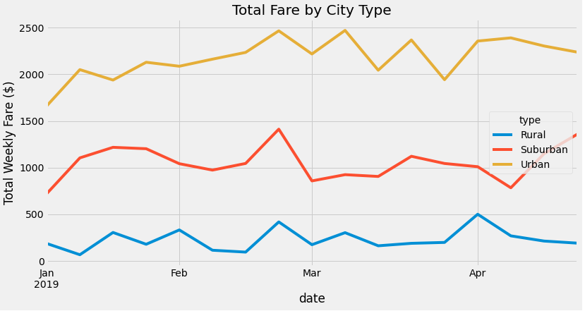
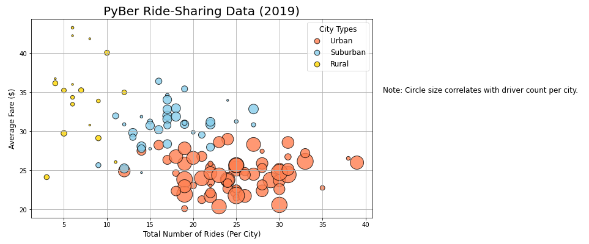
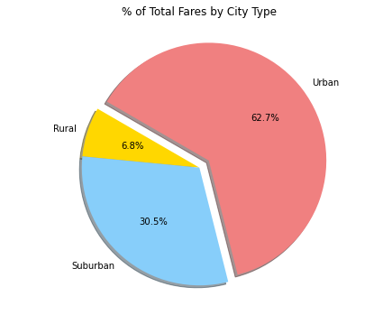
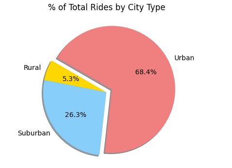
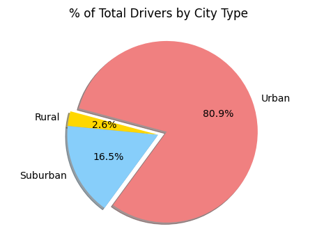

# PyBer Analysis

## Overview of the PyBer Analysis

### Purpose

The purpose of this project is to perform an exploratory analysis on data for Pyber, a python-based ride sharing app company. This project aims to perform an exploratory analysis on large csv files by showcasing the relationship between the type of city, and the number of driver and riders, as well as the percentage of the total fares, riders, and drivers by type of city (urban, suburban, and rural).  

This analysis aims to help Pyber improve access to ride-sharing services and determine affordability for underserved neighborhoods.  

## Results 

### Results of Pyber Analysis  

There are significant differences in the total fare by city type (Figure 1). Urban cities consistently have the highest fares, followed by suburban, and finally rural cities with the lowest total fares. The data also shows that the most rides occur in urban cities (Figure 3), and the highest total amount of drivers are in urban cities (Figure 4).

#### Figure 1
  

#### Figure 2

#### Figure 3

#### Figure 4

#### Figure 5
  

## Summary

### Summary and Recomendations

 Out of the three city types, urban cities are the most significant. They have the highest amount of total rides, total drivers, total fares, average fare per ride and driver, and total fare by city type.  
 
 Based on the results of this project, the following three recommendations are given to the company.

 1. Review and implement a new pricing strategy of fare per ride in urban cities. 
 2. Increase the amount of drivers in urban cities to meet the high demand of riders. This can be done by incentivizing higher wages for urban drivers.
 3. Collect data on riders travelling from one city type to another.

 

